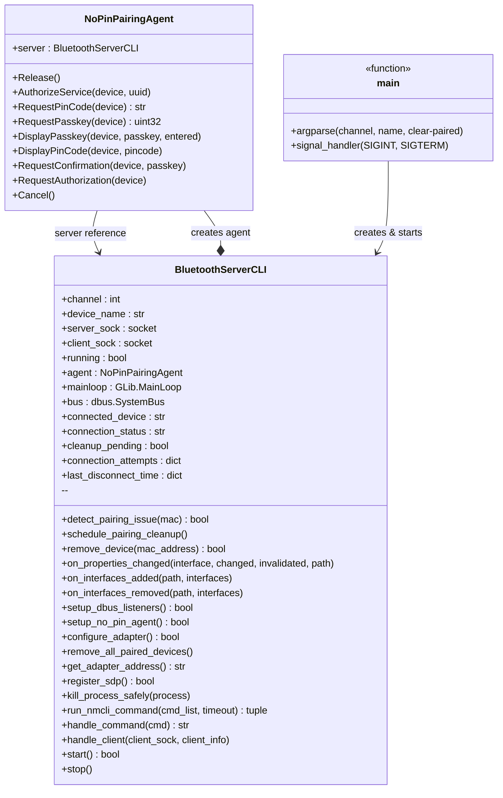
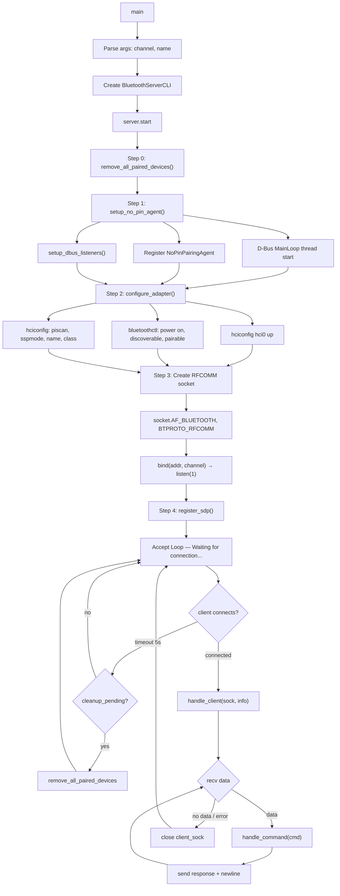
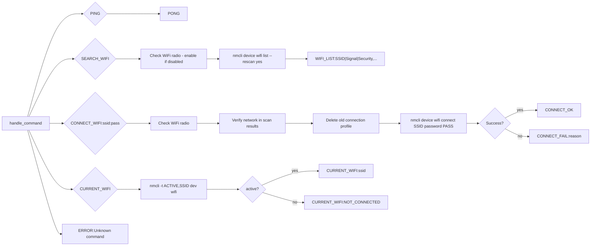
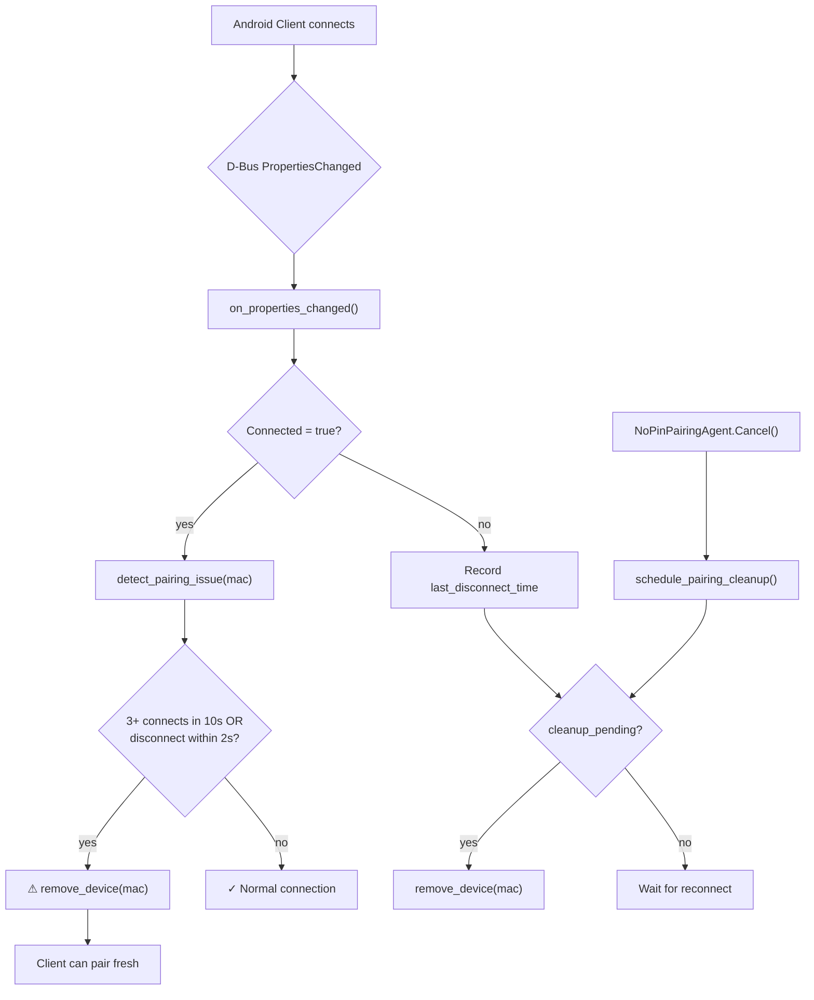

# bt_server_cli.py — အလုပ်လုပ်ပုံ

## Class Diagram



## Server Startup Flow



## Command Handler Flow



## Pairing & Auto-Cleanup Flow



## အကျဥ်းချုပ်

### Server အလုပ်လုပ်ပုံ

1. **Startup** — `main()` → `BluetoothServerCLI` object ဖန်တီးပြီး `start()` ခေါ်သည်
2. **D-Bus Agent** — `NoPinPairingAgent` သည် BlueZ နှင့် register ဖြစ်ပြီး pairing request များကို PIN/passkey မလိုဘဲ auto-accept လုပ်ပေးသည်
3. **Adapter Config** — `bluetoothctl` + `hciconfig` ဖြင့် discoverable/pairable ဖွင့်၊ device name သတ်မှတ်သည်
4. **RFCOMM Socket** — `socket.AF_BLUETOOTH` ဖြင့် RFCOMM channel ပေါ်တွင် listen လုပ်သည်
5. **Accept Loop** — Client ချိတ်ဆက်လာသည်နှင့် `handle_client()` ထဲဝင်ပြီး command-response loop ကို run သည်
6. **Command Protocol** — newline-terminated text commands (PING, SEARCH_WIFI, CONNECT_WIFI, CURRENT_WIFI)
7. **WiFi Control** — `nmcli` ဖြင့် WiFi scan/connect/status စစ်ဆေးသည်
8. **Auto-Cleanup** — Rapid connect/disconnect pattern ကို detect လုပ်ပြီး stale pairing info ကို auto-remove လုပ်ပေးသည်

### Function အုပ်စုများ

| အုပ်စု | Functions | ရည်ရွယ်ချက် |
|---------|-----------|-------------|
| **Pairing Agent** | `NoPinPairingAgent.*` | PIN မလို pairing auto-accept |
| **Server Lifecycle** | `start()`, `stop()`, `main()` | Server စတင်/ရပ် |
| **BT Setup** | `setup_no_pin_agent()`, `configure_adapter()`, `register_sdp()` | Bluetooth adapter ပြင်ဆင် |
| **Connection** | `handle_client()`, `handle_command()` | Client data recv/send loop |
| **WiFi Operations** | `run_nmcli_command()`, `kill_process_safely()` | nmcli command execution |
| **D-Bus Events** | `on_properties_changed()`, `on_interfaces_added/removed()`, `setup_dbus_listeners()` | BT connection event tracking |
| **Pairing Cleanup** | `detect_pairing_issue()`, `remove_device()`, `remove_all_paired_devices()`, `schedule_pairing_cleanup()` | Stale pairing auto-fix |
| **Utility** | `get_adapter_address()` | Adapter MAC address ရယူ |

---

## FAQ — အမေးအဖြေ

### Q: ဒီ server app က ရှုပ်ထွေးမှုရှိလား?

**မရှုပ်ထွေးပါ။** `bt_server_cli.py` သည် **784 lines, Python file တစ်ခုတည်း** ဖြစ်ပြီး structure ကောင်းပါတယ်:

| အစိတ်အပိုင်း | Lines (ခန့်) | ရှုပ်ထွေးမှု |
|---|---|---|
| `NoPinPairingAgent` (D-Bus auto-pair) | ~60 | ရှင်းလင်း |
| `BluetoothServerCLI` (main server) | ~650 | အနည်းငယ် ရှည်ပေမယ့် logic ရှင်း |
| `main()` + argparse | ~40 | ရိုးရှင်း |

**ကောင်းတဲ့ အချက်များ:**
- Single file, dependencies နည်း (Python standard library + dbus + gi)
- Protocol ကရိုးရှင်း — newline-terminated text (PING, SEARCH_WIFI, CONNECT_WIFI, CURRENT_WIFI)
- WiFi control ကို `nmcli` subprocess ဖြင့် handle — ယုံကြည်စိတ်ချရ
- Auto-pairing (`NoInputNoOutput` D-Bus agent) — No PIN/passkey
- Pairing issue auto-detection + cleanup — robust

**အနည်းငယ် ပြုပြင်သင့်တဲ့ အချက်:**
- `handle_command()` function တစ်ခုတည်းထဲ WiFi logic အကုန်ပါ → CONNECT_WIFI logic ကို separate function ခွဲသင့်
- Error handling ပိုကောင်းအောင်လုပ်နိုင် (e.g., structured logging)
- Single-threaded client handling (client တစ်ယောက်ပဲ connect နိုင်) — ဒါပေမယ့် robot server မှာ client တစ်ယောက်ပဲလိုတာမို့ ပြဿနာမရှိ

### Q: အသစ်ပြန်ရေးသင့်လား?

**မရေးသင့်ပါ။** အကြောင်းပြချက်များ:

1. **လက်ရှိ code က အလုပ်ဖြစ်နေပြီ** — WiFi scan, connect, auto-pairing, cleanup logic အားလုံးပါ
2. **784 lines သာရှိ** — manageable size
3. **Python + D-Bus + nmcli** combination က Linux Bluetooth/WiFi management အတွက် standard approach
4. **BlueZ D-Bus API** ကို Python dbus module နဲ့ သုံးတာ production ready ဖြစ်ပြီးသား

### Q: C++ သုံးသင့်လား?

**မသုံးသင့်ပါ။** ဒီ server app အတွက် Python က ပိုသင့်တော်ပါတယ်:

| | Python (လက်ရှိ) | C++ |
|---|---|---|
| **D-Bus integration** | `python3-dbus` — 5 lines ပဲလို | `sdbus-c++` / `GDBus` — boilerplate အများကြီး |
| **nmcli subprocess** | `subprocess.run()` — ရိုးရှင်း | `popen()` / `QProcess` — ပိုရှုပ်ထွေး |
| **Bluetooth socket** | `socket.AF_BLUETOOTH` — built-in | BlueZ C API / Qt Bluetooth — header/linking ပိုလို |
| **Development speed** | မြန် | နှေး (compile, memory management) |
| **Maintenance** | လွယ်ကူ | ခက်ခဲ |
| **Performance** | I/O bound — Python က လုံလောက် | CPU intensive မဟုတ်မို့ benefit မရှိ |
| **Dependencies** | `apt install python3-dbus python3-gi` | Build toolchain + BlueZ dev headers + linking |

**C++ ကို သုံးသင့်တဲ့ အခြေအနေ:**
- Real-time motor control / sensor data processing (latency critical)
- Existing C++ robot framework (ROS2 node) ထဲ integrate လုပ်ချင်ရင်

ဒီ server app မှာ — Bluetooth RFCOMM accept → text command parse → nmcli subprocess run → text response send ဆိုတာ **100% I/O bound** ဖြစ်ပါတယ်။ Python performance က လုံလောက်ပါတယ်။

### Q: test_client.py ကို ဘယ်လိုသုံးရတာလဲ?

`test_client.py` က server ကို Bluetooth RFCOMM ဖြင့် test ချိတ်ဆက်ဖို့ Python client script ဖြစ်ပါတယ်။

**အသုံးပြုပုံ:**

```bash
# Robot server ရဲ့ Bluetooth MAC address လိုပါတယ်
sudo python3 scripts/test_client.py <BLUETOOTH_MAC_ADDRESS> [CHANNEL]

# ဥပမာ - default channel 1
sudo python3 scripts/test_client.py 88:D8:2E:76:DD:5A

# Custom channel သုံးချင်ရင်
sudo python3 scripts/test_client.py 88:D8:2E:76:DD:5A 2
```

**အလုပ်လုပ်ပုံ:**

1. **Auto-test** — ချိတ်ဆက်ပြီးတာနဲ့ command ၃ ခု အလိုအလျောက် test လုပ်ပေးပါတယ်:
   - `PING` → `PONG` ရမရ စစ်
   - `CURRENT_WIFI` → လက်ရှိ WiFi status စစ်
   - `SEARCH_WIFI` → WiFi network list scan

2. **Interactive mode** — auto-test ပြီးရင် command ကိုယ်တိုင် ရိုက်ထည့်နိုင်ပါတယ်:
   ```
   Enter command: PING
   Response: PONG

   Enter command: CONNECT_WIFI:MyWiFi:password123
   Response: CONNECT_OK

   Enter command: quit
   ```

**ကြိုတင်လိုအပ်ချက်:**
- Robot PC မှာ `bt_server_cli.py` run ထားရပါမယ်
- Test client run မယ့် PC မှာ Bluetooth adapter ရှိရပါမယ်
- Robot ရဲ့ Bluetooth MAC address သိရပါမယ် (server start လုပ်တဲ့အခါ terminal မှာ ပြပေးပါတယ်)
- `sudo` လိုပါတယ် (Bluetooth socket access အတွက်)
