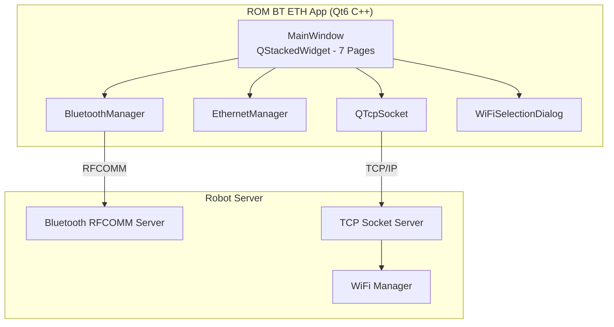
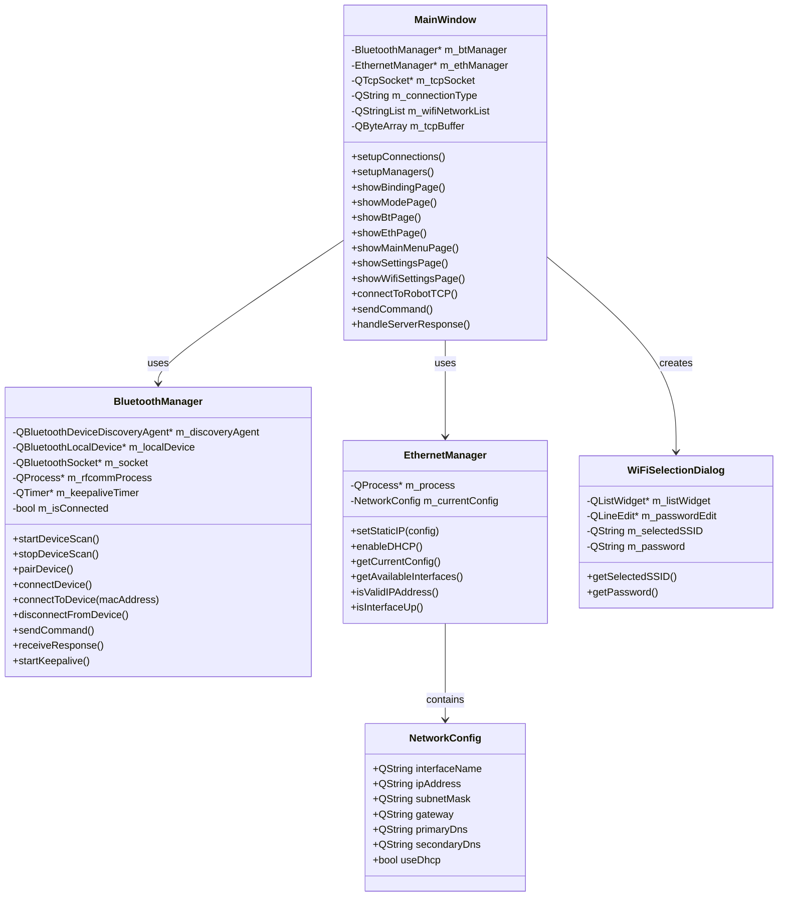
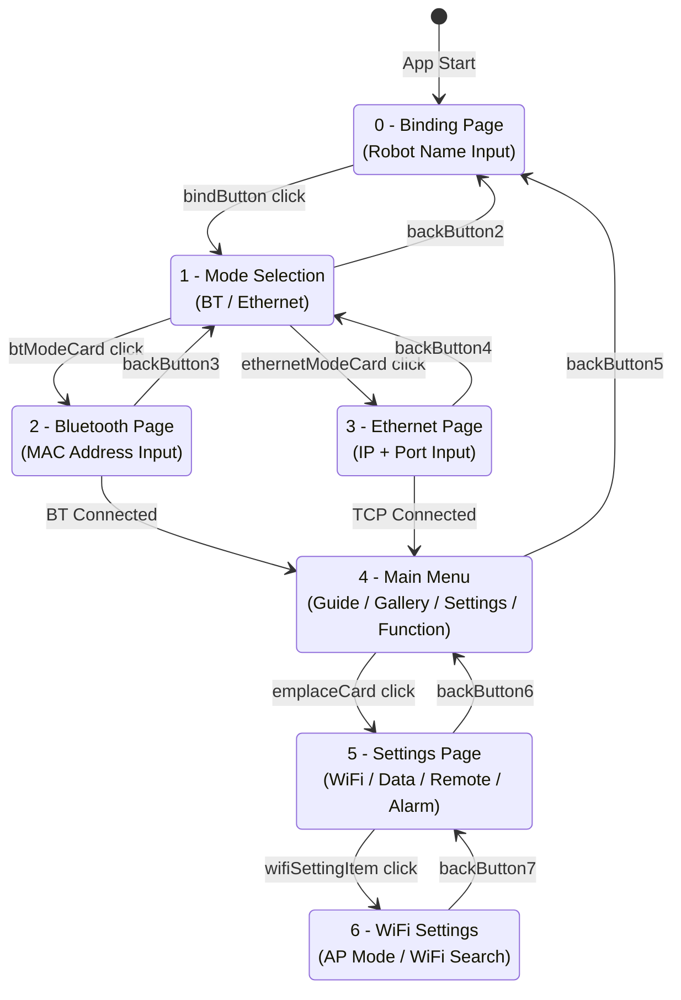
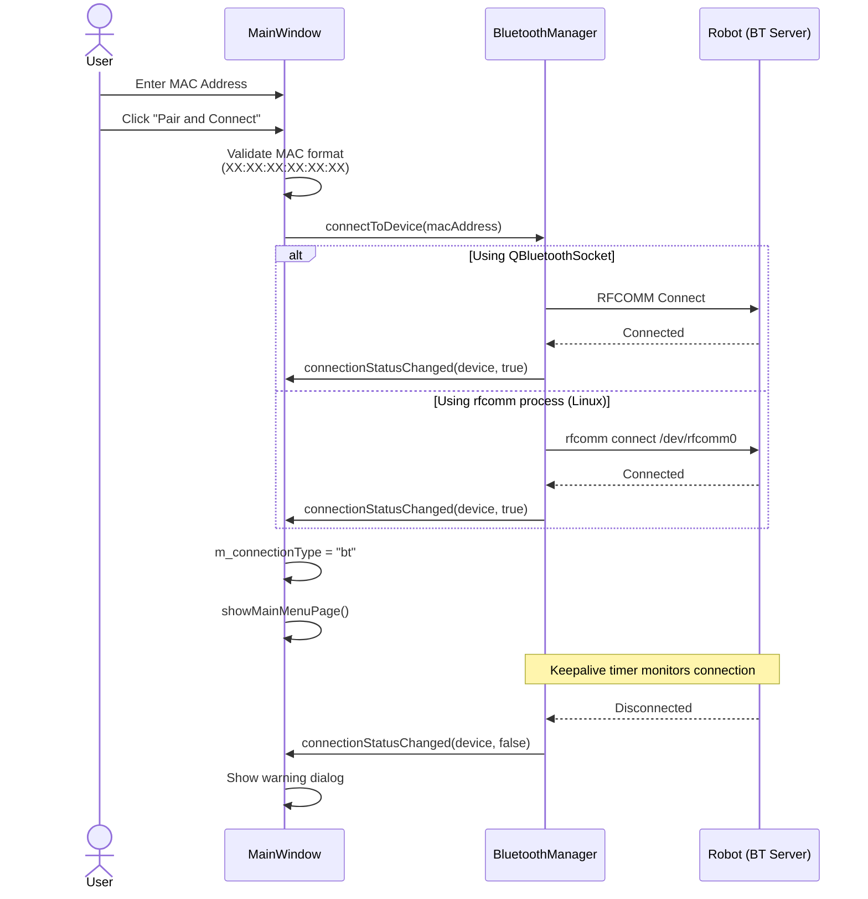
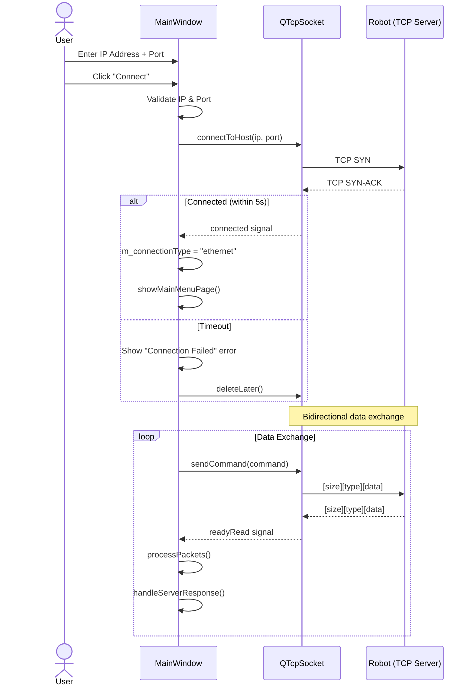
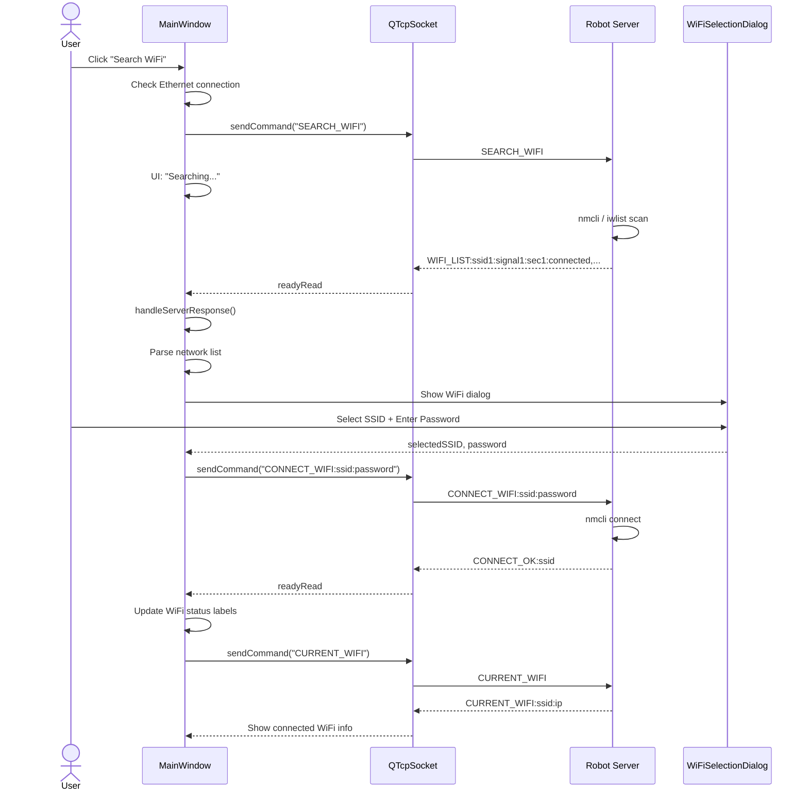
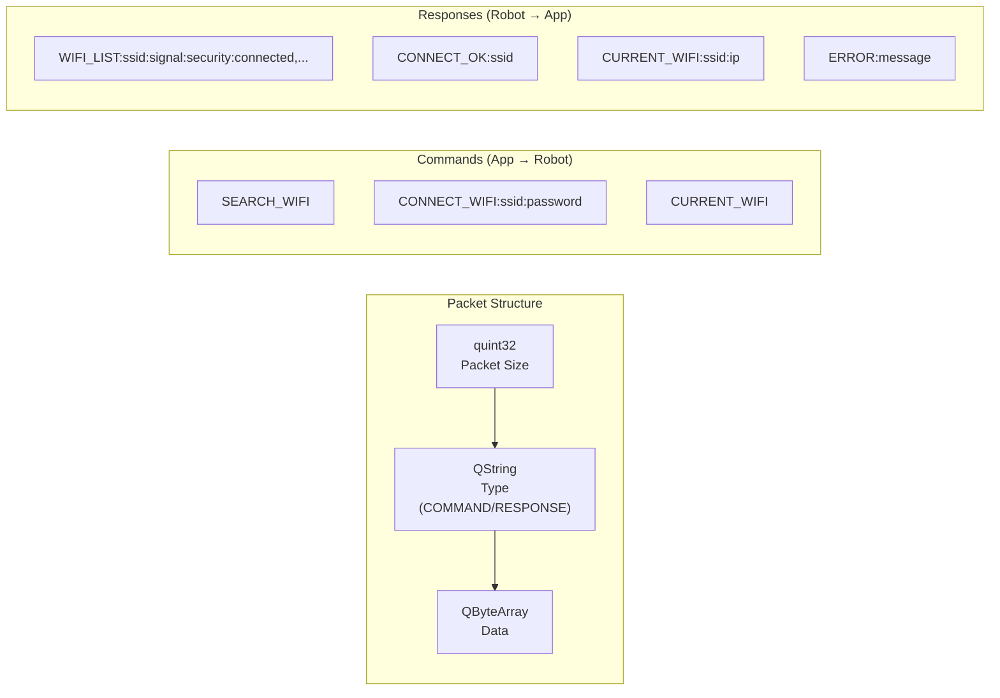
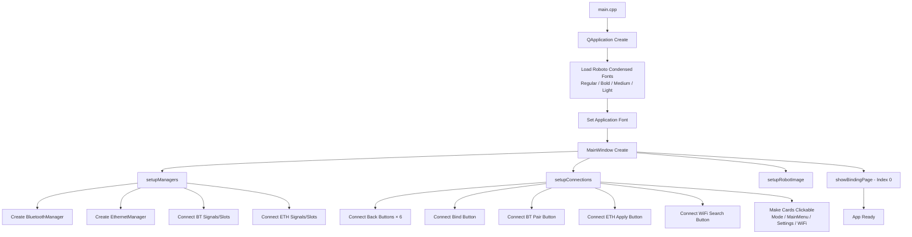
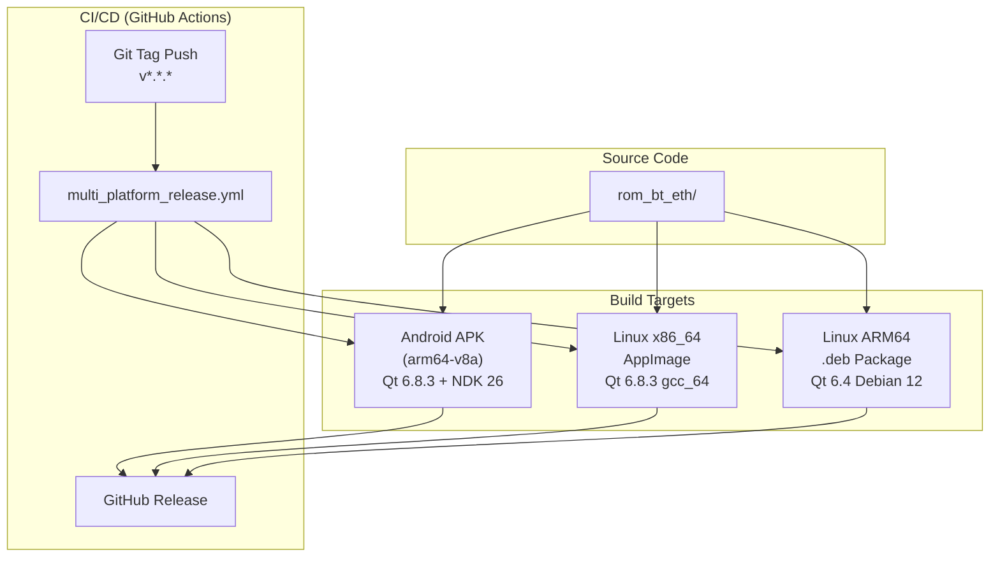
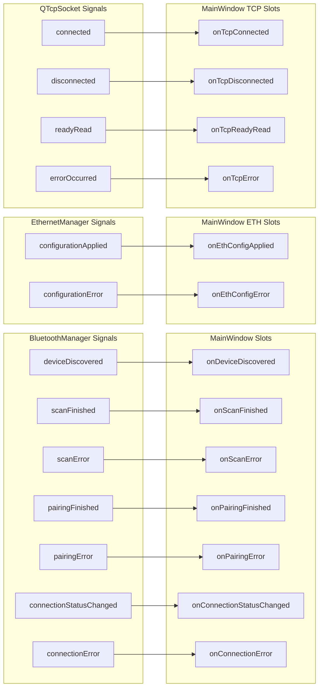

# ROM BT ETH - Application Architecture & Workflow

ROM Robotics Bluetooth and Ethernet Manager — Qt6 C++ GUI application for configuring WiFi, Bluetooth and Ethernet connections on autonomous mobile robots.

---

## 1. System Overview

---

## 2. Class Diagram

---

## 3. Page Navigation Flow (QStackedWidget)

---

## 4. Bluetooth Connection Flow

---

## 5. Ethernet (TCP) Connection Flow

---

## 6. WiFi Management Flow (via TCP)

---

## 7. TCP Packet Protocol

---

## 8. Application Startup Flow

---

## 9. Build & Deployment Targets

---

## 10. Signal-Slot Connection Map

